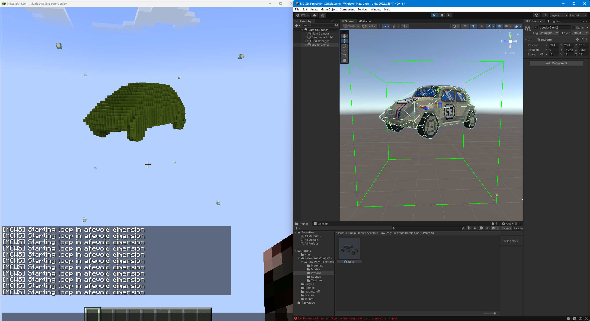

### **README.md**

# **Unity-to-Minecraft 3D Object Projection**

This project demonstrates how to project 3D objects from **Unity** into **Minecraft** using a grid of sensors to detect object positions. It leverages WebSocket communication to send `setblock` commands to a Minecraft server, updating block states based on the current and previous sensor states. This technique minimizes the number of commands sent by only transmitting changes (delta optimization).

---

## **Table of Contents**
- [Overview](#overview)
- [Sensors and Grid Management](#sensors-and-grid-management)
- [WebSocket Plugin](#websocket-plugin)
- [Command Optimization](#command-optimization)

---

## **Overview**

This project projects 3D object data from Unity into Minecraft by mapping the grid of **sensors** in Unity to **Minecraft blocks**. The grid detects whether sensors are occupied by objects and sends WebSocket commands to the Minecraft server to set the corresponding blocks in the **afevoid dimension**.

The sensors track object positions in real time, and the system is optimized to only update blocks that have changed states (e.g., from empty to occupied or vice versa). This results in efficient WebSocket communication and minimal overhead on the Minecraft server.

---

## **Sensors and Grid Management**

The core of the project revolves around a 3D grid of sensors, which are managed by the **`GridManager`**. Each sensor is capable of detecting whether it is occupied by an object in Unity.

- **Grid**: The grid is represented by a 3D array of sensors (`GameObject[,,] grid`), with adjustable dimensions (e.g., `10x10x10` or more).
- **Sensor Detection**: Each sensor detects whether an object is occupying its space in the grid. This information is stored and compared with the previous state to determine which blocks in Minecraft need to be updated.
- **State Tracking**: The grid keeps track of two states:
  - **CurrentOccupiedSensors**: Sensors that are currently occupied.
  - **PreviousOccupiedSensors**: Sensors that were occupied in the last frame.
- **Grid Size**: The grid size and the individual cube size are fully customizable for different projection scales.

---

## **WebSocket Plugin**

The project uses the **Minecraft WebSocket Integration Plugin** to communicate with the Minecraft server. This plugin enables sending Minecraft commands, such as `/setblock`, through a WebSocket connection.

- **WebSocket Connection**: The connection is established when the Unity project starts, and it remains open throughout the lifetime of the scene. Commands are sent in real-time, based on changes detected in the Unity scene.
- **Minecraft Commands**: Commands are formatted as `setblock` commands and sent to a custom dimension (`afevoid`), allowing for visualization in a clear, void-like world. This helps ensure that only the relevant blocks are displayed, making it easier to see the changes.

---

## **Command Optimization**

### **Delta-Based Optimization**
To reduce the number of `setblock` commands sent to the Minecraft server, the system uses a **delta-based optimization** approach. Instead of sending commands for all sensors in the grid, only the **changed sensors** (deltas) are processed.

- **Newly Occupied Sensors**: If a sensor was previously empty but is now occupied, a `setblock` command is sent to place the corresponding block in Minecraft.
- **Newly Unoccupied Sensors**: If a sensor was previously occupied but is now empty, a `setblock` command is sent to remove the block (by setting it to air).
- **Efficient Command Execution**: This method ensures that only changes in sensor states are transmitted, significantly reducing the load on the server by avoiding unnecessary block updates.

**Example of Command Optimization**:
- **Before**: Every sensor sends a `setblock` command regardless of its state.
- **After**: Only sensors that have changed states (occupied to unoccupied or vice versa) send `setblock` commands.

---

## **Image Previews**

---
